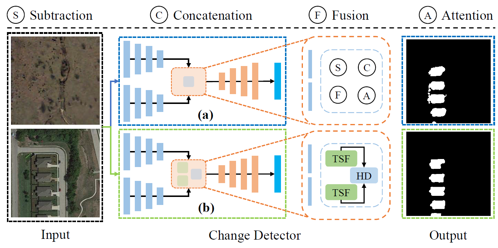
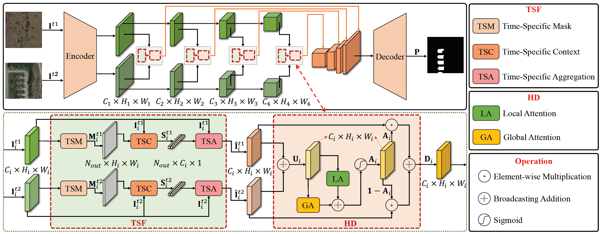
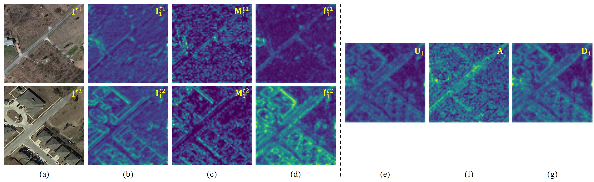
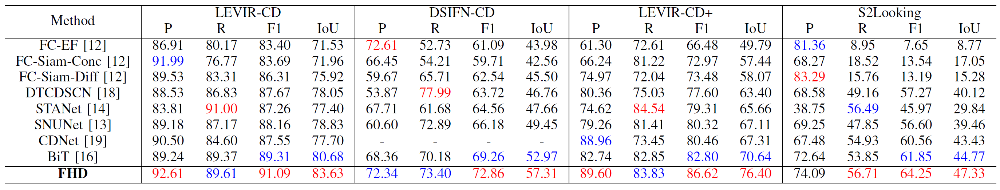
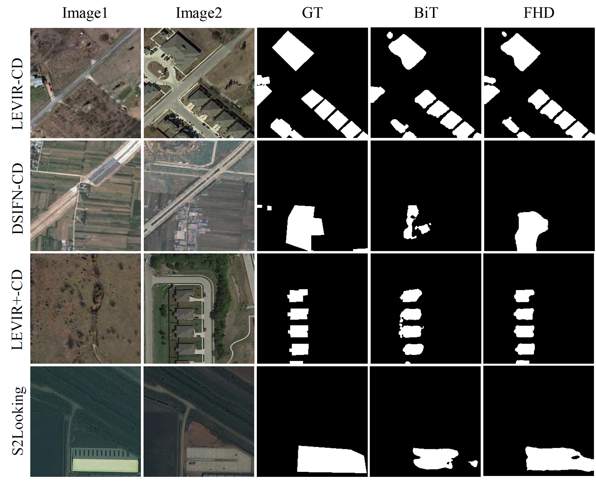

## Overview
> This repository is the official PyTorch implementation for FHD:<br>
> **[Feature Hierarchical Differentiation for Remote Sensing Image Change Detection](https://ieeexplore.ieee.org/document/9837915)**<br>


## Motivation

Figure 1: Comparison of different CD methods. (a) Previous methods. The
deep features of each temporal RS image are extracted by backbone networks,
followed by feature differentiation learning, such as subtraction, concatenation,
fusion, and attention. (b). Proposed FHD. We propose a novel Feature
Hierarchical Differentiation method with TSF and HD modules to select and
fuse critical features. Compared to the previous techniques, the proposed FHD
exhibits higher change detection performance.

## Framework

Figure 2: The framework of our proposed FHD.

## Dependencies
To simplify the reproduction steps, we only need to install
```bash
pip install torch==1.7.1 torchvision==0.8.2
pip install mmcv-full==1.3.8 -f https://download.openmmlab.com/mmcv/dist/cu101/torch1.7.0/index.html
pip install opencv-python
```

## Dataset
1. Download from [LEVIR](https://justchenhao.github.io/LEVIR/), [DSIFN](https://github.com/GeoZcx/A-deeply-supervised-image-fusion-network-for-change-detection-in-remote-sensing-images/tree/master/dataset), [LEVIR+](https://github.com/S2Looking/Dataset), and [S2Looking](https://github.com/S2Looking/Dataset).
2. Crop RS images size of 256 × 256, DSIFN did not crop with 512 × 512.
3. Format as follows:
```
|CD_Dataset
|----train
|---------|A
|---------|B
|---------|label
|----val
...
|----test
...
```


## Training
> Download [MiT-b2 weights](https://drive.google.com/drive/folders/1b7bwrInTW4VLEm27YawHOAMSMikga2Ia) pretrained on ImageNet-1K, and put them in a folder `model_ckpt/`.

```bash
# single GPU (V100 16G)
bash train_eval.sh
```

## Testing
Download [LEVIR, DSIFN, LEVIR+, S2Looking](https://drive.google.com/drive/folders/1am8UiWnvVs72jQo41U0s1pkD4jfO4gsu?usp=sharing), and put it in a folder `model_ckpt/`.

```bash
# single gpu (V100 16G)
bash infer_levir.sh
bash infer_dsifn.sh
bash infer_levir+.sh
bash infer_s2looking.sh
```
## Feature Maps

## Quantitative Results

## Qualitative Results


## Citation

If you find this useful in your research, please consider citing:

```
@article{pei2022feature,
  title={Feature Hierarchical Differentiation for Remote Sensing Image Change Detection},
  author={Pei, Gensheng and Zhang, Lulu},
  journal={IEEE Geoscience and Remote Sensing Letters},
  year={2022},
  publisher={IEEE}
}
```
